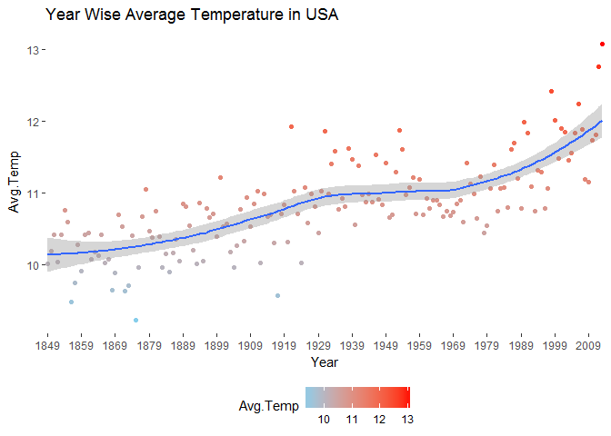
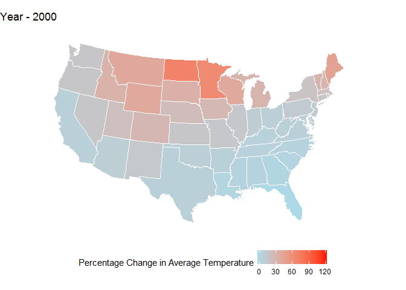
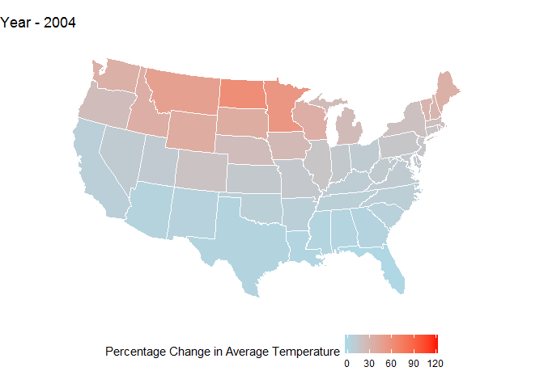
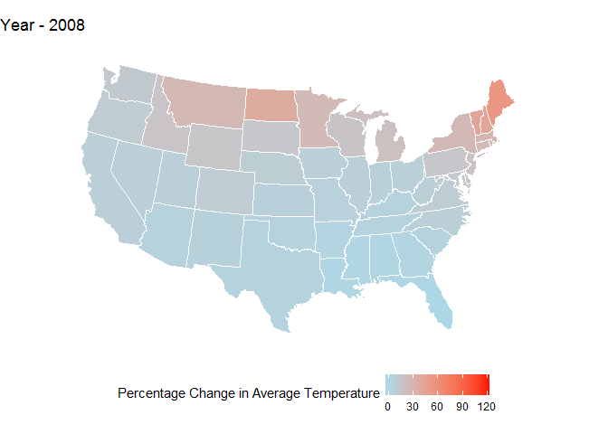
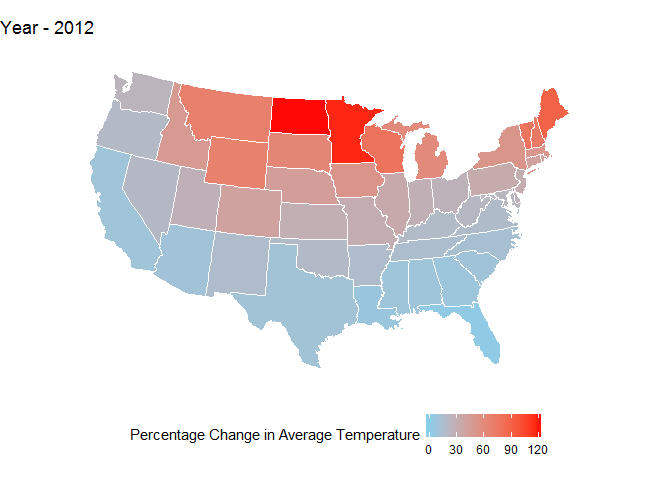
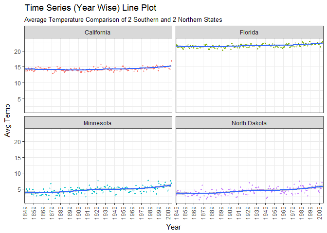
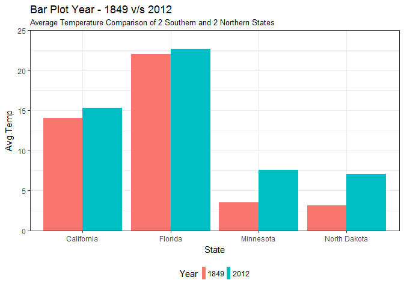

# 120-Percentage-Change-in-Avg-Temperature-USA-Map-Plot

USA - Map Plot | Climate Change | 120% Change in Average Temperature
================
Pulkit Sikri

Data source: <https://www.kaggle.com/berkeleyearth/climate-change-earth-surface-temperature-data/data>

``` r
climate = read.csv('C:\\Users\\Administrator\\Desktop\\back up\\practice\\Climate Change\\GlobalLandTemperaturesByState.csv')
climate$dt = as.Date(climate$dt)
climate$Year = format.Date(climate$dt,format = "%Y")
climate$Month = format.Date(climate$dt,format = "%m")
library(ggplot2)
library(dplyr)
library(ggmap)
library(gridExtra)
```

``` r
climate.usa = climate %>% filter(Country == 'United States')
```

``` r
climate.usa %>% filter(Year >=1849) %>% group_by(Year) %>% summarise(Avg.Temp = mean(AverageTemperature,na.rm = T)) %>%
  ggplot(aes(x=Year,y=Avg.Temp,col= Avg.Temp))+
  geom_point()+
  geom_smooth(aes(group = 1))+
  scale_color_continuous(low = "sky blue",high = "red")+
  scale_x_discrete(breaks = seq(1849,2012,10))+
  theme(panel.background = element_blank(),
        legend.position = "bottom")+
  labs(title = "Year Wise Average Temperature in USA")
```



**We can see that the overall temperature in USA is increasing, let us look at the rate of change in USA as per different states**

**Next we will do a Map Plot of percentage increase in Average Temperature with respect to Year 1849.**

*Please bear with the long code, I promise the outcome will be quite interesting*

``` r
### 1849


avg.temp1849 = climate.usa %>% filter(Year == 1849) %>% group_by(State) %>% summarise(avg.temp.1849 = mean(AverageTemperature,na.rm = T))

usa.map = map_data("state")

a= unique(usa.map$region)

avg.temp1849$State = tolower(avg.temp1849$State)
avg.temp1849$State[11] = a[10]


usa.map = merge(x=usa.map,y=avg.temp1849,by.x = "region",by.y = "State",all.x = TRUE)


## 2000

avg.temp2000 = climate.usa %>% filter(Year == 2000) %>% group_by(State) %>% summarise(avg.temp.2000 = mean(AverageTemperature,na.rm = T))

avg.temp2000$State = tolower(avg.temp2000$State)
avg.temp2000$State[11] = a[10]


usa.map = merge(x=usa.map,y=avg.temp2000,by.x = "region",by.y = "State",all.x = TRUE)


## 2004

avg.temp2004 = climate.usa %>% filter(Year == 2004) %>% group_by(State) %>% summarise(avg.temp.2004 = mean(AverageTemperature,na.rm = T))

avg.temp2004$State = tolower(avg.temp2004$State)
avg.temp2004$State[11] = a[10]


usa.map = merge(x=usa.map,y=avg.temp2004,by.x = "region",by.y = "State",all.x = TRUE)


## 2008


avg.temp2008 = climate.usa %>% filter(Year == 2008) %>% group_by(State) %>% summarise(avg.temp.2008 = mean(AverageTemperature,na.rm = T))

avg.temp2008$State = tolower(avg.temp2008$State)
avg.temp2008$State[11] = a[10]


usa.map = merge(x=usa.map,y=avg.temp2008,by.x = "region",by.y = "State",all.x = TRUE)

## 2012


avg.temp2012 = climate.usa %>% filter(Year == 2012) %>% group_by(State) %>% summarise(avg.temp.2012 = mean(AverageTemperature,na.rm = T))


avg.temp2012$State = tolower(avg.temp2012$State)
avg.temp2012$State[11] = a[10]


usa.map = merge(x=usa.map,y=avg.temp2012,by.x = "region",by.y = "State",all.x = TRUE)


usa.map$change2000 <- (usa.map$avg.temp.2000 - usa.map$avg.temp.1849)*100/usa.map$avg.temp.1849
usa.map$change2004 <- (usa.map$avg.temp.2004 - usa.map$avg.temp.1849)*100/usa.map$avg.temp.1849
usa.map$change2008 <- (usa.map$avg.temp.2008 - usa.map$avg.temp.1849)*100/usa.map$avg.temp.1849
usa.map$change2012 <- (usa.map$avg.temp.2012 - usa.map$avg.temp.1849)*100/usa.map$avg.temp.1849


p1 <- ggplot() + geom_polygon(data = usa.map,aes(x=long,y=lat,group = group,fill = change2000),col = "white")+
  scale_fill_continuous(low="light blue",high = "red",limits = c(-0.15,122),name = "Percentage Change in Average Temperature")+
    theme_nothing(legend = T)+
  theme(legend.position = "bottom")+
  labs(title = "Year - 2000")+
  coord_map("albers",  at0 = 45.5, lat1 = 29.5)


p2 <- ggplot() + geom_polygon(data = usa.map,aes(x=long,y=lat,group = group,fill = change2004),col = "white")+
  scale_fill_continuous(low="light blue",high = "red",limits = c(-0.15,122),name = "Percentage Change in Average Temperature")+
    theme_nothing(legend = T)+
  theme(legend.position = "bottom")+
  labs(title = "Year - 2004")+
  coord_map("albers",  at0 = 45.5, lat1 = 29.5)


p3 <- ggplot() + geom_polygon(data = usa.map,aes(x=long,y=lat,group = group,fill = change2008),col = "white")+
  scale_fill_continuous(low="light blue",high = "red",limits = c(-0.15,122),name = "Percentage Change in Average Temperature")+
    theme_nothing(legend = T)+
  theme(legend.position = "bottom")+
  labs(title = "Year - 2008")+
  coord_map("albers",  at0 = 45.5, lat1 = 29.5)


p4 <- ggplot() + geom_polygon(data = usa.map,aes(x=long,y=lat,group = group,fill = change2012),col = "white")+
  scale_fill_continuous(low="sky blue",high = "red",limits = c(-0.15,122),name = "Percentage Change in Average Temperature")+
  theme_nothing(legend = T)+
  theme(legend.position = "bottom")+
  labs(title = "Year - 2012")+
  coord_map("albers",  at0 = 45.5, lat1 = 29.5)
```

USA - States
============

Percentage increase in Average Temperature with respect to Year 1849
--------------------------------------------------------------------

#### Please note that the minimum and maximum value of scale used for Percentage Change in Average Temperature is same for all the map plots below



**Woah! we can clearly see that the Percentage change is increasing year by year.**

**Also, if you notice the percentage change in Northern states is comparatively higher than southern States, Next we will compare two Northern and two Southern States for change is Average Temperature**

Northern States v/s Southern States
-----------------------------------

#### North Dakota and Minnesota v/s Florida and California

``` r
climate.usa %>% filter(Year >= 1849,State %in% c("Florida","North Dakota","California","Minnesota")) %>% group_by(Year,State) %>% summarise(Avg.Temp = mean(AverageTemperature)) %>%
  ggplot(aes(x=Year,y=Avg.Temp))+
  geom_point(aes(col=State),size = 0.8,show.legend = F)+
  geom_smooth(aes(group = State))+
  scale_x_discrete(breaks = seq(1849,2012,10))+
  theme_bw()+
  theme(axis.text.x = element_text(angle = 90,vjust = 0.4))+
  labs(title = "Time Series (Year Wise) Line Plot" ,subtitle = "Average Temperature Comparison of 2 Southern and 2 Northern States")+
    facet_wrap(~State)
```

    ## `geom_smooth()` using method = 'loess'



**As you can see the slope of North Dakota and Minnesota is steeper as compared to California and Florida which are more or less flat**

**Below is a bar plot which will help us understand the difference in change in average temperature more clearly**

``` r
climate.usa %>% filter(Year %in% c(1849,2012),State %in% c("Florida","North Dakota","California","Minnesota")) %>% group_by(Year,State) %>% summarise(Avg.Temp = mean(AverageTemperature)) %>%
  ggplot(aes(x=State,y=Avg.Temp))+
  geom_bar(aes(fill = Year),stat = "identity",position = "dodge")+
  scale_y_continuous(expand = c(0,0),limits = c(0,25))+
  theme_bw()+
  theme(legend.position = "bottom",
        legend.key.width = unit(.2,"cm"))+
  labs(title = "Bar Plot Year - 1849 v/s 2012" ,subtitle = "Average Temperature Comparison of 2 Southern and 2 Northern States")
```



**We can see that the change in Northern States (Minnesota and North Dakota) is significantly more than the change in Southern States (California and Florida).**

Thankyou for looking over my project. Cheers!

**Also, go plant a tree,two if you're from Northern part of USA.**
